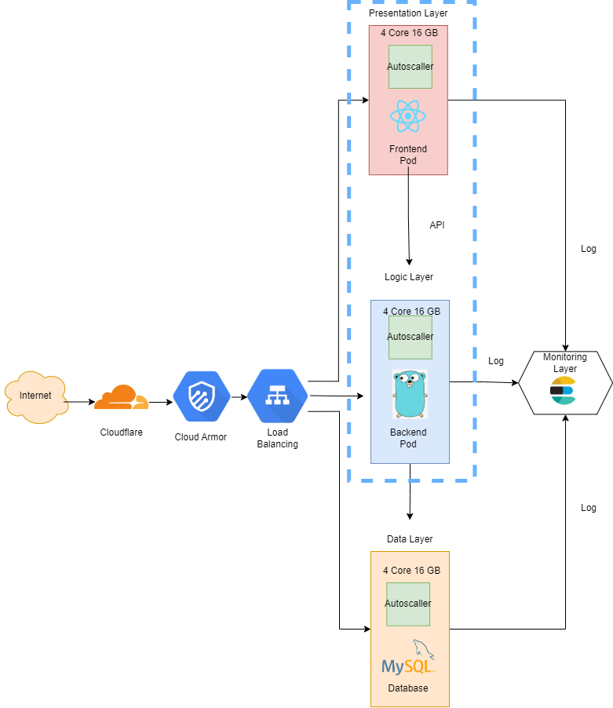

# Olin-Test

This assignment used for recruitment process at OLIN - All-in-one Pharmacy Management System

## N-tier Interface

Teknologi yang digunakan dalam pendesainan arsitektur untuk N-tier architecture beserta alasannya adalah sebagai berikut:

1. Cloudflare: Digunakan untuk domain yang ada agar dapat digunakan SSL sekaligus bergua sebagai proxy.
2. Cloud Armor: Digunakan sebagai security dari cloud agar tidak ada serangan DDoS seperti SQL Injection dan lain lain.
3. Load Balancer: Digunakan untuk menghandle request yang banyak, tujuannya adalah agar traffic yang ada dalam kasus ini adalah 100.000 user tidak berlebih langsung ke satu server tapi beban tersebut dibagi lagi.
4. Presentation Layer: Merupakan sebuah layer untuk bagian frontend.
5. Auto Scaller: Digunakan untuk meng scale sebuah server sesuai dengan workload yang ada. Jika workload sudah berlebih dan kapasitas server sudah penuh maka server akan secra aotomatis melakukan scalling resource secara horizontal.
6. Logic Layer: Digunakan untuk layer yang merupakan backend atau adanya proses cloud computing.
7. Data Layer: Digunakan sebagai Layer Database untuk menyimpan data user dan data lainnya seperti gambar.
8. Monitoring Layer: Digunakan untuk memonitor server yang ada bagaimana traffic dan juga kesehatan dari servernya.
9. Spesifikasi VM: 4 Core 16 GB dikarenakan terdapat GKE di dalamnya. Hal tersebut cukup dikarenakan sudah terdapat juga autoscaller di dalamnya.

## Aplikasi yang dideploy

1. Untuk mengakses aplikasi yang sudah dideploy dapat mengunjungi [Link](https://olin-test.syauqi-lab.my.id) berikut.
2. Untuk Melihat pipeline jenkins dari aplikasi yang dibuat dapat mengunjungi [Link](http://jenkins.syauqi-lab.my.id:8080) berikut.

## Notes

Untuk file provider.tf access key dan secret key dari AWS saya hilangkan karena mendapat alert dari Git dan juga AWS Terima Kasih
